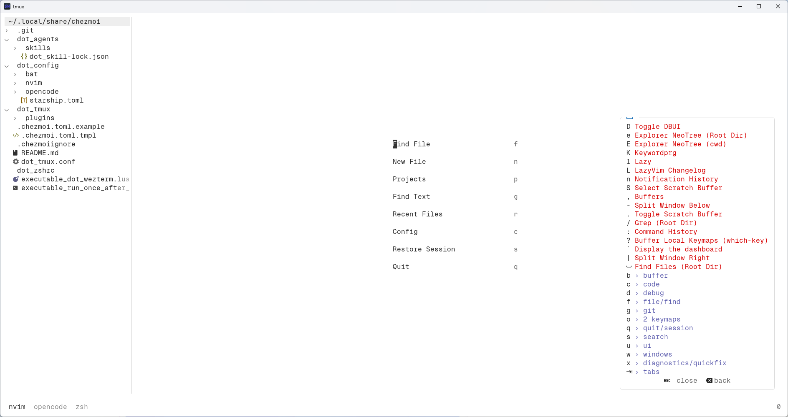

# Dotfiles

Machine-agnostic, transferrable dotfiles managed with [chezmoi](https://www.chezmoi.io/).



## Specifications

- **Terminal**: [WezTerm](https://wezterm.org/)
- **Operating System**: Fedora (via [WSL2](https://learn.microsoft.com/en-us/windows/wsl/))
- **Shell**: [Zsh](https://www.zsh.org/) with the [Oh My Zsh framework](https://ohmyz.sh/) and the [Starship prompt](https://starship.rs/)
- **Multiplexer**: [Tmux](https://tmux.app/)
- **Code Editor**: [Neovim](https://neovim.io/) with the [LazyVim distribution](https://www.lazyvim.org/)
- **AI Agent Harness**: [OpenCode CLI](https://opencode.ai/)
- **Dotfiles Manager**: [chezmoi](https://www.chezmoi.io/)

## Configuration

These values are not hardcoded. They are prompted once on `chezmoi init` and stored in
`~/.config/chezmoi/chezmoi.toml` (`[data]` section). A documented example lives
in `.chezmoi.toml.example` in this repo (it is not read by chezmoi — it is a
`.env.example`-style reference).

| Key                      | Meaning                                      | Default                           |
| ------------------------ | -------------------------------------------- | --------------------------------- |
| `opencode_model`         | Default model for **all** OpenCode agents    | `opencode/deepseek-v4-flash-free` |
| `opencode_model_plan`    | Override for the `plan` agent only           | inherits `opencode_model`         |
| `opencode_model_build`   | Override for the `build` agent only          | inherits `opencode_model`         |
| `opencode_model_general` | Override for the `general` agent only        | inherits `opencode_model`         |
| `opencode_model_explore` | Override for the `explore` agent only        | inherits `opencode_model`         |
| `opencode_model_scout`   | Override for the `scout` agent only          | inherits `opencode_model`         |
| `jdtls_path`             | Absolute path to your `eclipse.jdt.ls` clone | **required, no default**          |

Setting only `opencode_model` makes every agent use that one model. To diverge a
single agent, add its key in `~/.config/chezmoi/chezmoi.toml` and re-run
`chezmoi apply`.

The Java LSP intentionally does **not** use Mason — the [eclipse.jdt.ls](https://projects.eclipse.org/projects/eclipse.jdt.ls/) host is
slow, so we rely on a local clone you point `jdtls_path` at.

## Getting Started

```sh
chezmoi init --apply <your-repo-url>
```

This will:

1. Clone this repo to `~/.local/share/chezmoi`.
2. Render `.chezmoi.toml.tmpl` → `~/.config/chezmoi/chezmoi.toml`, prompting for
   `opencode_model` (with the free default offered) and `jdtls_path` (required).
3. Apply every dotfile, templating `opencode.jsonc` and `java.lua`.
4. Run `run_once_after_install-tpm.sh` once, which clones TPM and installs your
   tmux plugins automatically. You never need to press `prefix + I`.

To change your answers later:

```sh
chezmoi edit-config          # opens ~/.config/chezmoi/chezmoi.toml
chezmoi apply                # re-render everything
```

`chezmoi edit-config` opens the file in your editor (already auto-aplying on save
via the `[edit]` settings), so just change a line and `:w`.

### Resetting Your Configuration

Answers live in `~/.config/chezmoi/chezmoi.toml` (or
`$XDG_CONFIG_HOME/chezmoi/chezmoi.toml` if `XDG_CONFIG_HOME` is set). Because the
prompts use `promptStringOnce`, `chezmoi init` only re-asks a key that is **missing**
from that file — so to reset, you delete the value(s) first.

- **Re-prompt everything (full reset):**

  ```sh
  rm "${XDG_CONFIG_HOME:-$HOME/.config}/chezmoi/chezmoi.toml"
  chezmoi init
  ```

- **Re-prompt a single value:** open `chezmoi edit-config`, delete just that one
  line (e.g. `jdtls_path = "..."`), save, then run `chezmoi init` — only the
  missing key is asked again.

- **`jdtls_path` is now required.** Leaving it empty aborts `chezmoi init` with
  `jdtls_path cannot be empty`. Just run `chezmoi init` again and type the real
  path to your `eclipse.jdt.ls` clone.

## Daily Editing

You have two auto-applying paths — both apply on save, no manual step needed:

- **`chezmoi edit <file>`** — opens the source file and auto-applies on every
  save (configured via `[edit] apply=true watch=true` in `.chezmoi.toml.tmpl`).
  This is the recommended daily command.
- **`nvim ~/.local/share/chezmoi/...`** — a Neovim `BufWritePost` autocmd (in
  `dot_config/nvim/lua/config/autocmds.lua`) runs `chezmoi apply` in the
  background whenever you save any file inside the chezmoi source dir.

Inspect what changed before/after with `chezmoi diff`.

## Reverting an Applied Modification

Auto-apply means saving the source file immediately updates the real target
(e.g. `~/.zshrc`). If you then decide you don't want it and revert the source
with git (`git restore dot_zshrc` inside `~/.local/share/chezmoi`), the **real
target still holds the unwanted version** until you push the revert:

```sh
chezmoi diff     # shows target differs from the reverted blueprint
chezmoi apply    # overwrites the target with the reverted blueprint
```

`chezmoi apply` always makes the target match the blueprint — it is the fix.

## Tmux Plugins

The `dot_tmux/plugins/**` tree is listed in `.chezmoiignore` and is **not**
committed. Instead it is installed automatically by `run_once_after_install-tpm.sh`
on first `chezmoi apply`. If you later add a plugin to `dot_tmux.conf`, you can
still run `prefix + I` (or just `chezmoi apply` re-runs the script only if its
hash changed — for new plugins use `prefix + I`).

## Tmux Keybindings

`<prefix>` is `C-b` (Ctrl-b) by default. The custom binds below are defined in
`dot_tmux.conf`; the rest are provided by `tmux-sensible` and `tmux-resurrect`.

| Key                                   | Action                                                                  | Defined by     |
| ------------------------------------- | ----------------------------------------------------------------------- | -------------- |
| `prefix + c`                          | New window **after** the current one (`new-window -a`)                  | custom         |
| `prefix + C`                          | New window **before** the current one (`new-window -b`)                 | custom         |
| `prefix + b`                          | Jump to the **last** (previously active) window (`last-window`)         | custom         |
| `prefix + <` / `prefix + >`           | Move current window left / right, **keeping focus** on it               | custom         |
| `prefix + &`                          | Kill the current window (with confirmation)                             | custom         |
| `prefix + K`                          | Kill the entire tmux server (with confirmation)                         | custom         |
| `prefix + R`                          | Reload the tmux config                                                  | tmux-sensible  |
| `prefix + C-p` / `prefix + C-n`       | Previous / next window                                                  | tmux-sensible  |
| `prefix + Ctrl-s` / `prefix + Ctrl-r` | Save / restore the session                                              | tmux-resurrect |

## Typical Daily Workflow

A day-to-day flow using this setup:

1. **Start a session.** Launch Tmux, e.g. `tmux new -s work` (or just `tmux`).
2. **Open Neovim.** Inside the first window run `nvim` to begin editing.
3. **Open new windows.** Split work across windows with `prefix + c` (after) or
   `prefix + b` (before).
4. **Organize windows.** Reorder them with `prefix + <` / `prefix + >`.
5. **Run Tmux commands.** From inside Tmux open the command prompt with
   `prefix + :`, or run tmux commands directly from the shell.
6. **Save the session.** Persist the layout with `prefix + Ctrl-s`
   (tmux-resurrect).
7. **Detach or kill.** Leave with `prefix + d` (detach) or tear everything down
   with `prefix + K` (kill server).
8. **Restore later.** After a restart, `prefix + Ctrl-r` brings the saved
   session back. Config edits reload instantly via `prefix + R` or
   `chezmoi apply`.

## Updating

```sh
chezmoi update --apply     # pull latest repo + apply
```

## Planned

- Add a minimal script to automate resetting the chezmoi configuration values
  (currently done manually via `rm` + `chezmoi init`, or by deleting a single
  key in `chezmoi edit-config`).

## Note

This configuration is Linux-only; `java.lua` hardcodes `config_linux` for
[eclipse.jdt.ls](https://projects.eclipse.org/projects/eclipse.jdt.ls/).
